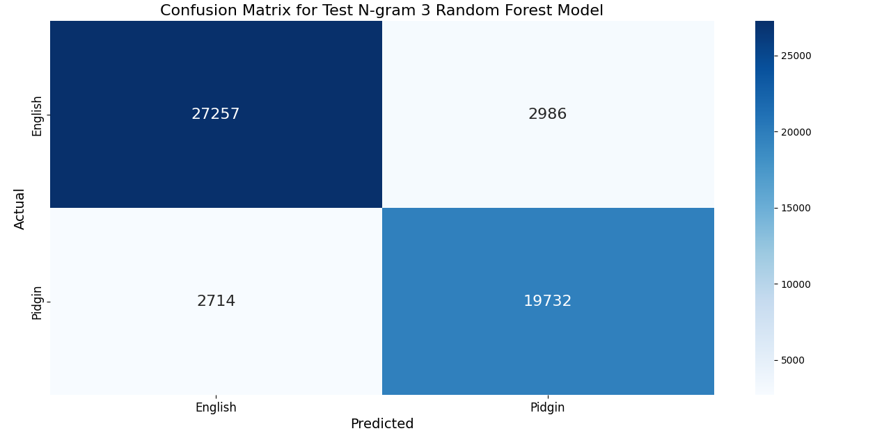
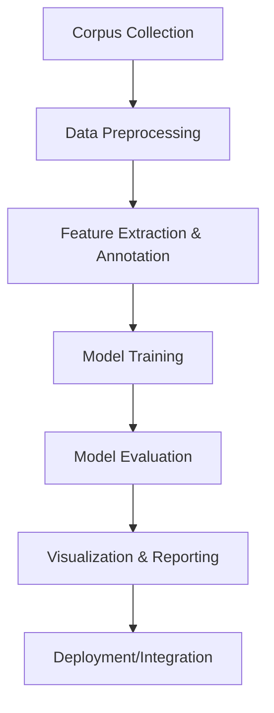

# Code-Switching Detection Between Nigerian Pidgin English and Standard English

## Overview

This project implements an automatic system for detecting and segmenting code-switching between Nigerian Pidgin English (NPE) and Standard English. It employs multiple modelling paradigms, including traditional machine learning classifiers, Bidirectional LSTM (BiLSTM), and compression-based models using Prediction by Partial Matching (PPM) via the Tawa toolkit.

The system can accurately identify language boundaries in mixed-language text, allowing for fine-grained language analysis and potential applications in multilingual NLP systems.

## Key Features

- **Comprehensive Corpus**: Multi-domain corpus compiled from literary texts, forum discussions, and online media
- **Multiple Model Paradigms**: Implementation of traditional ML, neural, and compression-based approaches
- **Character-Level Evaluation**: Fine-grained evaluation using character-level comparison between model outputs and gold-standard annotations
- **Visualization Tools**: Analysis and visualization of linguistic patterns and model performance

## Installation

### Clone the repository
git clone https://github.com/yourusername/nlp-pidgin-code-switching.git
cd nlp-pidgin-code-switching

### Install dependencies
pip install -r requirements.txt

### Install the package in development mode
pip install -e .

## Usage

### Train traditional machine learning models
python -m src.main train --model-type traditional

### Train BiLSTM model
python -m src.main train --model-type bilstm

### Train PPM compression models
python -m src.main train --model-type ppm

### Evaluate all models
python -m src.main evaluate --all

### Compare model performance
python -m src.main compare-models

### Generate visualizations
python -m src.main visualize

## Results
The project demonstrates that compression-based models (PPM) offer competitive performance compared to supervised approaches for code-switching detection. Notably, our **Test N-gram 3 Random Forest** and **Test N-gram 5 Random Forest** models achieved the highest accuracy of **0.89**, with PPM-based models performing exceptionally well for Pidgin text identification. Below, we present a series of visualizations to summarize our findings.

### Performance Comparison

| Performance Metric: | Test N-gram 3 Random Forest | Test N-gram 5 Random Forest | PPM (Order 2) | LR (6-gram) | BiLSTM |
| ------------------- | ---------------------------: | ---------------------------: | ------------: | ----------: | -----: |
| Accuracy:           | 0.89                       | 0.89                       | 0.89         | 0.87       | 0.78   |
| F1-Score:           | 0.89                       | 0.89                       | 0.89         | 0.87       | 0.77   |
| Precision:          | 0.89                       | 0.89                       | 0.89         | 0.86       | 0.75   |
| Recall:             | 0.89                       | 0.89                       | 0.89         | 0.88       | 0.80   |

### Confusion Matrix for the Best Model

To gain deeper insight into classification performance, the following confusion matrix is provided for the best performing model, **Test N-gram 3 Random Forest**:

*Figure: Confusion matrix for the Test N-gram 3 Random Forest model.*

### Data Pipeline Overview

Below is a flow diagram that summarizes our data pipeline—from corpus collection to model deployment:

## License
This project is licensed under the MIT License - see the LICENSE file for details.

## Contact
Godspower Ogbonda - ogbondagodspower30@gmail.com
